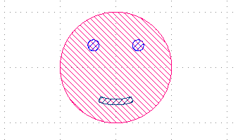

# pc\_smiley



This repository is intended as an example
of a minimal pycif package,
consisting of one component contained in one Python file.

## Installing

It's a good idea to include an `installing` section
in your project's README, even if it's as simple as

```
pip install git+https://gitlab.example.com/exp-ast/pc_smiley
```

# File Structure

The rest of this README explains what each file in this example repository does.
The overall file structure looks like this

```
<repository root>
│
├── pc_smiley
│   │ 
│   ├── Smiley.py
│   └── __init__.py
│
├── .gitignore
├── pyproject.toml
│
├── README.md
└── img
    └── Smiley.png
```

## `Smiley.py`

This is the star of the show,
the file which contains our component.

Note that almost every single line starts with at least an indent block.
The only lines which are in the toplevel of the file are the
module docstring at the very top,
the `import pycif` line,
and the `Smiley` class declaration.

You might have some stray code in your file that
tests something,
or exports the component.
Delete it!
Otherwise, all of that code will run the moment
the user runs `import pc_smiley`!

## `__init__.py`

This file is necessary to get Python to recognize `pc_smiley`
as a package.

It also does a minor,
but very useful thing called *namespace flattening*.
Read the comment inside `__init__.py` to find out more!

## .gitignore

`.gitignore` tells git what files to ignore.
This can be stuff like temporary files created by your text
editor or IDE.
It's also nice to include files that may accidentally end
up in the repository (e.g. `.cif` output files).

Note that since `.gitignore` starts with a dot,
you might not be able to see this file in GUI file browsers.

This repository contains a reasonable `.gitignore`,
but you should do your own research and add any unwanted files
that your development environment creates.
Usually, it's enough to look up
`<name of thing you're using to write python> .gitignore`
in your search engine of choice.

## `pyproject.toml`

This file tells pip about your package.
It contains metadata like package name, version, author,
and licensing information.
It also contains a list of dependencies and
instructions that pip will use to setup your package.

Not that long ago, the function of `pyproject.toml` was done by a different
file called `setup.py`.
Indeed, many large projects still rely on `setup.py`,
and you are free to do so too,
but it's always best to follow the latests practices.

## `README.md`

This is the file you're reading right now!

This file is an (optional (but strongly recommended))
description of your package to help other people
understand what it's all about.

The `.md` file extension indicates that it's written in the
Markdown language.
Markdown files are just plaintext files with some extra
formatting.
You are probably already familiar with Markdown
from Reddit, Discord, and Whatsapp.
Here is a quick refresher:

````markdown
# This is a heading
## This is a subheading
### This is a subsubheading

this is a normal text

this is normal text on a new paragraph
but this is normal text on the same paragraph,
since there is no skipped line

*this text is bold*

_this text is italic_

`this is inline code`

```
this is a code block
```

```python
this is a code block with Python syntax highlight
```

[this](http://example.com) is a hyperlink

If your normal text containst asterisks, underscores,
or other format characters,
you have to escape them with backslashes,
like this: \_\_init.py\_\_

Below (would be) an image:


| Table column 1      | Table column 2 |
| ------------------- | -------------- |
| This                | Is             |
| A                   | Table          |

This is $` A = 2 \pi r^2 `$ inline math.
This is also $ A = 2 \pi r^2 $ inline math.
This is math on a separate line:

$$
A = 2 \pi r^2
$$

````

## `img`

You can put any pictures you want to include in your `README.md`
into this directory.
It's a good idea to include a screenshot of your component(s)
in KLayout.
If you're only going to have one picture,
you can put it into the root of the repository as well,
and skip having an `img` directory.

If you are opposed to storing images in git due to religious reasons,
feel free to skip out on this.
However, please be mindful that some people have no problem with this,
and it is their right to put binary files into version control systems.
Tolerance and intercultural understanding are paramount to effective
collaborative programming.

